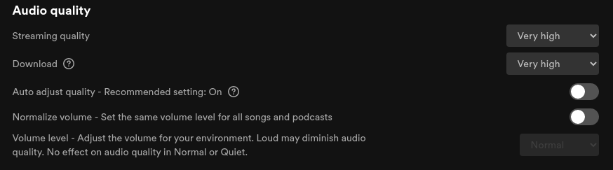

# Spotify Recorder

A Linux tool for recording Spotify audio streams with high quality using PipeWire.

## ⚠️ Legal Disclaimer

**This tool is provided for educational and research purposes only.**

### Important Legal Notice

- **Recording audio from Spotify violates [Spotify's Terms of Service](https://www.spotify.com/legal/end-user-agreement/) and [User Guidelines](https://www.spotify.com/legal/user-guidelines/)**
- Spotify explicitly prohibits "ripping, recording, or copying" content
- **Use of this tool may result in Spotify account suspension or termination**
- This software is provided **AS-IS** without warranties of any kind
- **Authors are not responsible for any misuse, damages, or consequences**
- **Users are solely responsible for compliance with applicable laws and terms of service**

### Recommended Legal Uses

- Educational study of Linux audio recording techniques
- Testing D-Bus/MPRIS integration and PipeWire audio routing
- Research purposes for understanding audio streaming technology
- Personal backups of content you legally own and have rights to

**By using this software, you acknowledge and accept these terms.**

---

## Features

- 🎵 Record individual tracks or entire playlists
- 🎚️ High-quality recording (320kbps MP3, 44.1kHz)
- 🔇 Silent recording (no audio output during recording)
- 🏷️ Automatic ID3 metadata tagging
- 🎼 Optional lyrics embedding
- 📋 Playlist support with automatic track management
- 🔄 Skip already-recorded tracks
- 🎛️ PipeWire native (Fedora 42+ optimized)

---

## Requirements

### Mandatory

- **Spotify Premium account** (320kbps streaming required)
- **Linux with PipeWire** (Fedora 42+, Ubuntu 24.04+, or Arch)
- **Python 3.10+**
- **Spotify desktop client** (flatpak or snap)

### System Packages

| Distribution | Packages |
|-------------|----------|
| **Fedora 42+** | `pipewire-utils ffmpeg python3-pip playerctl` |
| **Ubuntu 24.04+** | `pipewire-pulse ffmpeg python3-pip playerctl` |
| **Arch** | `pipewire ffmpeg python playerctl` |

### Spotify Installation

| Distribution | Recommended Method | Command |
|-------------|-------------------|---------|
| **Fedora** | Flatpak | `flatpak install com.spotify.Client` |
| **Ubuntu** | Snap | `snap install spotify` |
| **Arch** | AUR | `yay -S spotify` |

**⚠️ Important:** Only install ONE version (flatpak OR snap, not both) to avoid D-Bus conflicts.

---

## Installation

### 1. Clone Repository

```bash
git clone https://github.com/cloudconsultants/spotify-recorder.git
cd spotify-recorder
```

### 2. Run Automated Installer

```bash
cd src
./install.sh
```

Or install manually:

### 3. Manual Installation

**Fedora:**
```bash
sudo dnf install pipewire-utils ffmpeg python3-pip playerctl
flatpak install com.spotify.Client
```

**Ubuntu:**
```bash
sudo apt install pipewire-pulse ffmpeg python3-pip playerctl
snap install spotify
```

**Arch:**
```bash
sudo pacman -S pipewire ffmpeg python playerctl
yay -S spotify
```

### 4. Install Python Dependencies

**Using `uv` (recommended - faster):**
```bash
curl -LsSf https://astral.sh/uv/install.sh | sh
uv sync
```

**OR using pip:**
```bash
pip install -r requirements.txt
```

### 5. Configure Flatpak Alias (Fedora only)

If using flatpak, add to `~/.bashrc`:
```bash
alias spotify='flatpak run --branch=stable --arch=x86_64 --command=spotify com.spotify.Client'
```

Then reload:
```bash
source ~/.bashrc
```

---

## Spotify API Setup

### Step 1: Create Spotify App

1. Visit [Spotify Developer Dashboard](https://developer.spotify.com/dashboard)
2. Click **"Create app"**
3. Fill in:
   - **App name:** `Spotify Recorder` (or any name)
   - **App description:** `Personal audio recorder`
   - **Redirect URI:** `http://127.0.0.1:8000/callback`
   - **Which API/SDKs:** Select **Web API**
4. Accept Terms of Service → Click **Save**

### Step 2: Get Credentials

1. On your app's dashboard, click **Settings**
2. Copy your **Client ID**
3. Click **View client secret** → Copy your **Client Secret**

### Step 3: Configure .env File

```bash
cp .env.example .env
nano .env  # or use your preferred editor
```

Replace the placeholder values:
```env
SPOTIFY_CLIENT_ID='your_actual_client_id_here'
SPOTIFY_CLIENT_SECRET='your_actual_client_secret_here'
SPOTIFY_REDIRECT_URI='http://127.0.0.1:8000/callback'
```

### Step 4: First Run OAuth Authorization

On first run, your browser will open for OAuth authorization:
1. Log in to Spotify
2. Click **Agree** to authorize
3. You'll be redirected to `http://127.0.0.1:8000/callback`
4. The terminal will confirm authorization

**Required OAuth Scopes** (automatically requested):
- `user-library-read`
- `user-read-playback-state`
- `user-read-currently-playing`

---

## Spotify Settings Configuration

**⚠️ CRITICAL:** Configure these settings in Spotify **before** recording:

### 1. Disable Audio Crossfading

**Settings → Playback:**


- ❌ Turn OFF **"Crossfade songs"**
- ❌ Turn OFF **"Automix"**

**Why:** Prevents audio from overlapping between tracks, ensuring clean recordings.

### 2. Set Maximum Audio Quality

**Settings → Audio Quality:**



- ✅ Set **"Streaming quality"** to **"Very high"** (320kbps)
- ❌ Turn OFF **"Auto adjust quality"**
- ℹ️ **"Normalize volume"** can be ON or OFF (personal preference)

**Why:** 320kbps streaming is required for high-quality recordings. Disabling auto-adjust prevents quality degradation on slow connections.

---

## Usage

### Basic Commands

```bash
# Record single track
./spotify-recorder https://open.spotify.com/track/TRACK_ID

# Record entire playlist
./spotify-recorder https://open.spotify.com/playlist/PLAYLIST_ID

# Record album
./spotify-recorder https://open.spotify.com/album/ALBUM_ID

# With verbose logging
./spotify-recorder https://open.spotify.com/track/TRACK_ID --verbose
```

### From src/ Directory

```bash
cd src
python3 api.py https://open.spotify.com/track/TRACK_ID
```

### Additional Options

```bash
./spotify-recorder --help

Options:
  --verbose          Enable detailed logging
  --overwrite        Overwrite existing recordings
  --update-metadata  Update metadata only (skip recording)
  --lyrics-mode      Add lyrics (none/synced)
  --order            Track order (first/last/random, default: last*)
  --no-record        Fetch metadata without recording
```

---

## How It Works

### Recording Flow

1. **Fetch Metadata:** Retrieve track info from Spotify Web API
2. **Start Spotify:** Launch desktop client via D-Bus/MPRIS
3. **Load Track:** Use D-Bus `OpenUri` to load specific track
4. **Verify Playback:** Wait for `PlaybackStatus = "Playing"`
5. **Find Audio Sink:** Detect Spotify's PipeWire sink-input
6. **Silent Recording:**
   - Create null sink for silent output
   - Move Spotify to null sink (you hear nothing)
   - Record from sink-input with `pw-record`
7. **Convert:** `ffmpeg` converts raw → MP3 (320kbps)
8. **Tag Metadata:** Add ID3 tags and optional lyrics
9. **Cleanup:** Terminate processes, remove temp files

#### Track Order Logic

By default, albums/playlist record in reverse order (20→19→18→...→1) for technical reliability:
- Less popular tracks typically have more stable streams
- Preserves API rate limits for important tracks
- Better error recovery if recording fails midway

Use `--order first` for normal sequence or `--order random` for shuffle.

### Technical Details

**PipeWire Recording Settings:**
- Format: 32-bit float (`f32`)
- Sample rate: 44100 Hz (Spotify native)
- Resampler quality: 15 (maximum)
- Bitrate: 320kbps MP3

**D-Bus Playback Control:**
- `Player.Play` → Activate device
- `Player.OpenUri` → Load track
- `Player.PlayPause` → Force playback
- `Player.SetPosition` → Seek to 0:00

---

## Spotify Free Tier (⚠️ Untested)

This tool is **untested** with Spotify Free accounts. Expected limitations:

| Feature | Free | Premium |
|---------|------|---------|
| Max Quality | 160kbps | 320kbps |
| Ads | Yes (recorded) | No |
| API Access | Limited | Full |
| Playback Control | May fail | Works |

**Recommendation:** Use Spotify Premium for reliable recording.

---

## Troubleshooting

### Issue: "Could not find Spotify audio sink"

**Cause:** Spotify not playing or slow internet connection preventing buffering.

**Solutions:**
1. Check Spotify can play audio normally
2. Wait for buffering on slow connections (script waits up to 30s)
3. Verify: `pactl list sink-inputs` shows Spotify while playing

### Issue: Wrong track playing / continues previous track

**Cause:** D-Bus OpenUri not loading correct track.

**Solution:** Ensure latest version with Play → OpenUri → PlayPause sequence. May require restarting Spotify.

### Issue: Multiple Spotify installations detected

**Symptoms:** Script warns about snap + flatpak both installed.

**Solution:**
```bash
# Remove snap version (recommended for Fedora):
sudo snap remove spotify

# OR remove flatpak version (recommended for Ubuntu):
flatpak uninstall com.spotify.Client
```

### Issue: Slow internet / Track won't start

**Symptoms:** "Waiting for playback... 0s (state: Paused, track: none)"

**Solution:** Script waits up to 30s for buffering. Be patient on slow connections. Playback must actually start before recording begins.

---

## Project Structure

```
spotify-recorder/
├── spotify-recorder          # Main executable wrapper
├── README.md                 # This file
├── LICENSE                   # MIT License
├── .env.example              # Environment template
├── .gitignore                # Git exclusions
├── requirements.txt          # Pip dependencies
├── pyproject.toml            # Modern packaging (uv)
├── src/                      # Source code
│   ├── api.py                # Main entry point
│   ├── recorder.py           # Recording orchestration
│   ├── playback_monitor.py   # Playback monitoring
│   ├── utils.py              # Utility functions
│   ├── spotdl.sh             # Bash recording script
│   └── install.sh            # Automated installer
├── docs/                     # Documentation
│   └── MODERNIZATION.md      # Technical changelog
└── assets/                   # Images and resources
    ├── spotify_settings_0.png
    └── spotify_settings_1.png
```

---

## Development

### Running Tests

```bash
# Test single track with verbose output:
./spotify-recorder https://open.spotify.com/track/TRACK_ID --verbose

# Dry run (metadata only, no recording):
./spotify-recorder https://open.spotify.com/track/TRACK_ID --no-record
```

### Debugging D-Bus

```bash
# Check Spotify D-Bus interface:
dbus-send --print-reply --dest=org.mpris.MediaPlayer2.spotify \
  /org/mpris/MediaPlayer2 org.freedesktop.DBus.Introspectable.Introspect

# Monitor playback state:
watch -n 1 'dbus-send --print-reply --dest=org.mpris.MediaPlayer2.spotify \
  /org/mpris/MediaPlayer2 org.freedesktop.DBus.Properties.Get \
  string:org.mpris.MediaPlayer2.Player string:PlaybackStatus'
```

---

## Contributing

Contributions are welcome! Please:

1. Fork the repository
2. Create a feature branch
3. Make your changes
4. Test thoroughly
5. Submit a pull request

**Note:** By contributing, you agree that your code will be licensed under the MIT License.

---

## License

MIT License - see [LICENSE](LICENSE) file for details.

**Disclaimer:** This software is provided AS-IS without warranty. Use at your own risk.

---

## Credits

- Original project by [cloudconsultants](https://github.com/cloudconsultants)
- Modernized for Fedora 42 + PipeWire (October 2025)
- Uses [Spotipy](https://github.com/spotipy-dev/spotipy) for Spotify Web API
- Uses [Mutagen](https://github.com/quodlibet/mutagen) for ID3 tagging

---

## Additional Resources

- [Spotify Developer Documentation](https://developer.spotify.com/documentation/web-api)
- [PipeWire Documentation](https://pipewire.org/)
- [MPRIS Specification](https://specifications.freedesktop.org/mpris-spec/latest/)
- [Technical Changelog](docs/MODERNIZATION.md)
